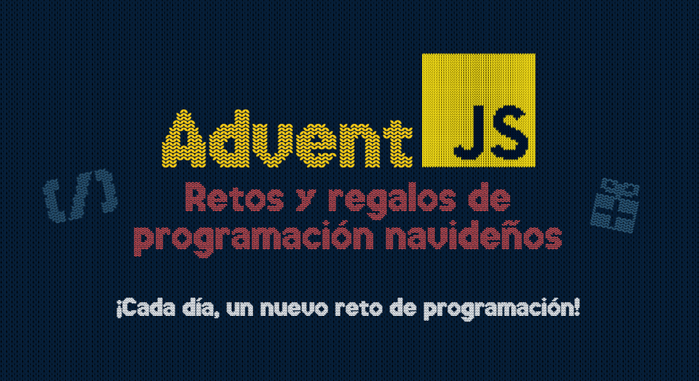
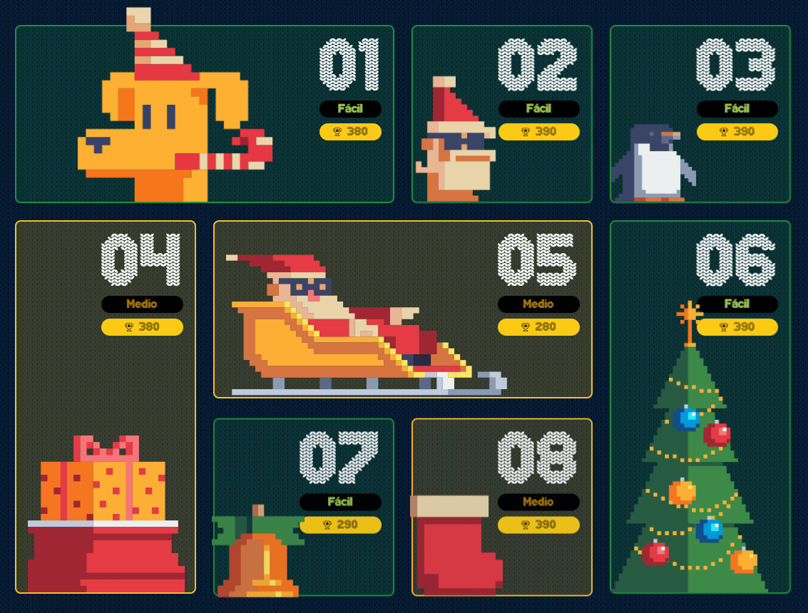

# ⭐ Adventjs 2023🎄

Este repositorio contiene las soluciones a los challenges propuestos por [@midudev](https://midu.dev/) en [adventjs.dev](https://adventjs.dev/) website.

## 🎉 2023

> [!NOTE]
> Sección AI
> ¡Por supuesto! Aquí tienes un saludo con un tono más festivo y humorístico:

"¡Saludos a los Exploradores del Código Festivo! 🎄🎅

Las soluciones y algoritmos ofrecidos en este repositorio han sido cuidadosamente seleccionados utilizando la 'Fórmula Secreta de la Magia Navideña'. 🌟 Estamos hablando de una mezcla perfecta de operaciones por segundo y la cantidad justa de sorpresa para deleitar incluso a los elfos más astutos. 🧝‍♂️💻

Nos complace informarles que hemos logrado alcanzar niveles extraordinarios de velocidad y complejidad, ¡todo en el espíritu navideño! 🚀🎁 ¿Realmente funciona? ¡Por supuesto que sí! ¡Como un reno volador! 🦌

Por favor, tengan en cuenta que los comentarios de '¡Es demasiado complejo!' y '¿Esto realmente existe?' han sido estratégicamente ubicados para mantener un aura de misterio y asombro. 🤔✨

PD: La zona de quejas está ubicada cerca del árbol de Navidad, donde las luces intermitentes pueden o no aumentar tu paciencia mientras esperas tu turno en la cola del servidor.🎄🎉"

---

# ⭐ ¡Felices fiestas! 🎉🎁🎅

> [!IMPORTANT]
> Las soluciones - algoritmos propuestos en este repo están basados en la mejor puntuación para el juego, los puntos que se pueden obtener en cada reto varía según operaciones por segundo (ops) y [complejidad cognitiva](./Cognitive_Complexity_Sonar_Guide_2023.pdf) (cc). 
Aunque las soluciones y el código tenga malas prácticas, el juego te lleva a "optimizarlo" de esa manera a costa de legibilidad y comprensión, pero también se aprende algunas particularidades del lenguaje y te hace "pensar fuera de la caja".
Agradezco a la comunidad comunidad de [discord](https://discord.com/invite/midudev) de @midudev, por compartir tips y soluciones, que sirven para mejorar y continuar aprendiendo.

> [!TIP]
> - Cada 1000 ops sumas 100pts
> - La mínima cc es 1 y aumentarla resta 10pts por unidad
> - Los for .. of no aumentan la cc
> - usar operaciones binarias, estructuras de datos o "trucos" de js como el operador + para coercionar datos, puede ayudarte a evitar el uso de condicionales y asi evitar aumentar la complejidad cognitiva.

Mostrar / Ocultar

### 🕹️ Retos

|  #  |             Retos                    |   Dificultad    |                  Descripción                    |                 Solución               |
| :-: | :----------------------------------  | :------------:  | :---------------------------------------------: | :------------------------------------: |
| 01  | 🎁 ¡Primer regalo repetido!         |       🟩       | [ir](https://adventjs.dev/es/challenges/2023/1)  |         [reto #1](./reto%20%231)       |
| 02  | 🏭 Ponemos en marcha la fábrica     |       🟩       | [ir](https://adventjs.dev/es/challenges/2023/2)  |         [reto #2](./reto%20%232)       |
| 03  | 😏 El elfo travieso                 |       🟩       | [ir](https://adventjs.dev/es/challenges/2023/3)  |         [reto #3](./reto%20%233)       |
| 04  | 😵‍💫 Dale la vuelta a los paréntesis  |       🟨       | [ir](https://adventjs.dev/es/challenges/2023/4)  |         [reto #4](./reto%20%234)       |
| 05  | 🛷 El CyberTruck de Santa           |       🟨       | [ir](https://adventjs.dev/es/challenges/2023/5)  |         [reto #5](./reto%20%235)       |
| 06  | 🦌 Los renos a prueba               |       🟩       | [ir](https://adventjs.dev/es/challenges/2023/6)  |         [reto #6](./reto%20%236)       |
| 07  | 📦 Las cajas en 3D                  |       🟩       | [ir](https://adventjs.dev/es/challenges/2023/7)  |         [reto #7](./reto%20%237)       |
| 08  | 🏬 Ordenando el almacén             |       🟨       | [ir](https://adventjs.dev/es/challenges/2023/8)  |         [reto #8](./reto%20%238)       |
| 09  | 🚦 Alterna las luces                |       🟩       | [ir](https://adventjs.dev/es/challenges/2023/9)  |         [reto #9](./reto%20%239)       |
| 10  | 🎄 Crea tu propio árbol de navidad  |       🟩       | [ir](https://adventjs.dev/es/challenges/2023/10) |         [reto #10](./reto%20%2310)     |
| 11  | 📖 Los elfos estudiosos             |       🟨       | [ir](https://adventjs.dev/es/challenges/2023/11) |         [reto #11](./reto%20%2311)     |
| 12  | 📸 ¿Es una copia válida?            |       🟨       | [ir](https://adventjs.dev/es/challenges/2023/12) |         [reto #12](./reto%20%2312)     |
| 13  | ⌚️ Calculando el tiempo             |       🟩       | [ir](https://adventjs.dev/es/challenges/2023/13) |         [reto #13](./reto%20%2313)     |
| 14  | 🚨 Evita la alarma                  |       🟨       | [ir](https://adventjs.dev/es/challenges/2023/14) |         [reto #14](./reto%20%2314)     |
| 15  | ↔️ Robot autónomo                    |       🟨       | [ir](https://adventjs.dev/es/challenges/2023/15) |         [reto #15](./reto%20%2315)     |
| 16  | ❌ Despliegue en viernes            |       🟩       | [ir](https://adventjs.dev/es/challenges/2023/16) |         [reto #16](./reto%20%2316)     |
| 17  | 🛷 Optimizando el alquiler          |       🟩       | [ir](https://adventjs.dev/es/challenges/2023/17) |         [reto #17](./reto%20%2317)     |
| 18  |             --                   |       --       |                       --                        |                    --                   |
| 19  |             --                   |       --       |                       --                        |                    --                   |
| 20  |             --                   |       --       |                       --                        |                    --                   |
| 21  |             --                   |       --       |                       --                        |                    --                   |
| 22  |             --                   |       --       |                       --                        |                    --                   |
| 23  |             --                   |       --       |                       --                        |                    --                   |
| 24  |             --                   |       --       |                       --                        |                    --                   |
| 25  |             --                   |       --       |                       --                        |                    --                   |

> **Dificultad**: 🟩 Fácil 🟨 Medio 🟥 Difícil

