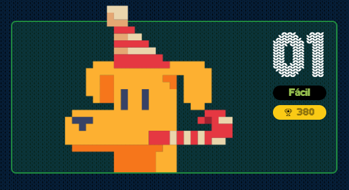

# reto #1 AdventJS



En la fábrica de juguetes del Polo Norte, cada juguete tiene un número de identificación único.

Sin embargo, debido a un error en la máquina de juguetes, algunos números se han asignado a más de un juguete.

¡Encuentra el primer número de identificación que se ha repetido, donde la segunda ocurrencia tenga el índice más pequeño!

En otras palabras, si hay más de un número repetido, debes devolver el número cuya segunda ocurrencia aparezca primero en la lista. Si no hay números repetidos, devuelve -1.

```javascript
const giftIds = [2, 1, 3, 5, 3, 2]
const firstRepeatedId = findFirstRepeated(giftIds)
console.log(firstRepeatedId) // 3
// Aunque el 2 y el 3 se repiten
// el 3 aparece primero por segunda vez

const giftIds2 = [1, 2, 3, 4]
const firstRepeatedId2 = findFirstRepeated(giftIds2)
console.log(firstRepeatedId2) // -1
// Es -1 ya que no se repite ningún número

const giftIds3 = [5, 1, 5, 1]
const firstRepeatedId3 = findFirstRepeated(giftIds3)
console.log(firstRepeatedId3) // 5

```
> [!IMPORTANT] ¡Ojo! Los elfos dicen que esto es una prueba técnica de Google.

## Notas de la Solución

```javascript
function findFirstRepeated(gifts) {
  /*
    filtramos los id, numero de identificación, que se repiten en orden de aparición
    para ello usamos el método filter y dentro indexOf donde comparamos 
    si el elemento actual tiene el mismo índice que el elemento encontrado
    indexOf nos retorna el primer elemento que coincide por lo cual los primeros valores
    no pasaran la condición hasta encontrar los repetidos en orden
  */
  let repeated = gifts.filter((id, index) => gifts.indexOf(id) !== index)
  /* 
    siguiente paso hacemos un push a nuestro array filtrado con repetidos, dado que si no
    encontramos repetidos nuestro respuesta debe ser -1 y nuestro array estará vacío, podemos usar
    este "hack" para evitar usar condicionales o ?? Nullish coalescing operator
    dado que tiene menor puntuación en el juego.
  */
  repeated.push(-1)
  // finalmente retornamos el primer elemento del arreglo, que será el primer repetido en aparecer en la lista o el -1
  return repeated[0]
}

```