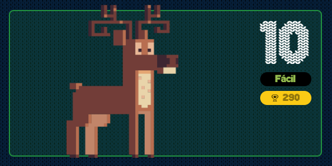

# reto #10 AdventJS



¡Vaya idea ha tenido Sam Elfman! Quiere ofrecer un servicio que te crea un árbol de Navidad 🎄 personalizado en cuestión de segundos.

Para crearlo nos pasan una cadena de caracteres para formar el árbol y un número que indica la altura del mismo.

Cada carácter de la cadena representa un adorno del árbol, y vamos utilizándolos de forma cíclica hasta llegar a la altura indicada. Como mínimo siempre nos pasarán uno.

Debemos devolver un string multilínea con el árbol de Navidad formado con los adornos, la altura indicada más una última línea con el tronco formado por el carácter | en el centro y, finalmente, un salto de línea \n.

Por ejemplo si recibimos la cadena "123" y el número 4 como altura, tendríamos que construir este árbol:

```bash
    1
   2 3
  1 2 3
1 2 3 1 2
    |
```
Si recibimos la cadena *@o y el número 3, el árbol que debemos devolver es:

```bash
  *
 @ o
* @ o
  |
```
Nota:

- El árbol siempre debe estar centrado, para ello añade espacios en blanco a la izquierda de cada línea.
- Crea espacios sólo a la izquierda de cada línea del árbol. No dejes espacios en blanco a la derecha.
- Los adornos tienen un espacio en blanco entre ellos de separación.