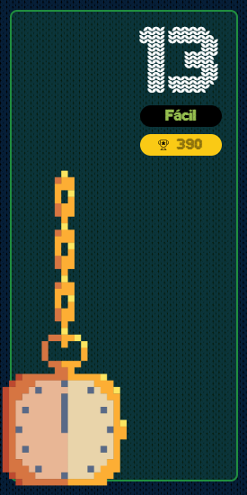

# reto #13 AdventJS



Los elfos están preparando la víspera de Navidad y necesitan tu ayuda para calcular si van sobrados o no de tiempo ⏳.

Para ello te pasan un array con la duración de cada entrega. El formato de la duración es HH:mm:ss, las entregas empiezan a las 00:00:00 y el límite de tiempo es 07:00:00.

Tu función debe devolver el tiempo que les faltará o el tiempo que les sobrará para terminar las entregas. El formato de la duración devuelta debe ser HH:mm:ss.

Si terminan antes de las 07:00:00, el tiempo restante hasta las 07:00:00 debe ser mostrado con un signo negativo. Por ejemplo, si sobran 1 hora y 30 minutos, devuelve -01:30:00

```javascript
calculateTime(['00:10:00', '01:00:00', '03:30:00'])
// '-02:20:00'

calculateTime(['02:00:00', '05:00:00', '00:30:00'])
// '00:30:00'

calculateTime([
  '00:45:00',
  '00:45:00',
  '00:00:30',
  '00:00:30'
]) // '-05:29:00'
```