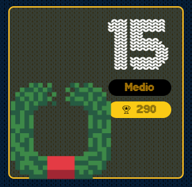

# reto #15 AdventJS



Estamos programando unos robots llamados giftbot 🤖🎁 que navegan de forma autónoma por los almacenes de regalos.

Estamos creando una función a la que le pasamos: el almacén 🏬 que deben navegar y los movimientos ↔️ que pueden realizar.

El almacén se representa como un array de cadenas de texto, donde:

```
. significa que hay vía libre.
* significa que hay un obstáculo.
! es la posición inicial del robot.
```
Los movimientos son un array de cadenas de texto, donde:

R mueve al robot una posición a la derecha.
L mueve al robot una posición a la izquierda.
U mueve al robot una posición hacia arriba.
D mueve al robot una posición hacia abajo.
Hay que tener en cuenta que el robot no puede superar los obstáculos ni los límites del almacén.

Dados un almacén y los movimientos, debemos devolver el array con la posición final de nuestro robot.

```javascript
const store = ['..!....', '...*.*.']

const movements = ['R', 'R', 'D', 'L']
const result = autonomousDrive(store, movements)
console.log(result)
/*
[
  ".......",
  "...*!*."
]
*/
// El último movimiento es hacia la izquierda, pero no puede moverse porque hay un obstáculo.

```
Ten en cuenta que la store es un array que puede ser de un número de filas que va de 1 a 100, ya que tenemos almacenes de todos los tamaños.
También que el robot es posible que termine en su posición inicial si no puede moverse o si está dando vueltas.