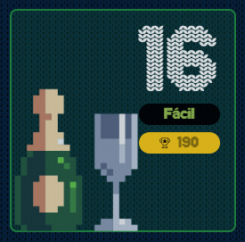

# reto #16 AdventJS



Ayer viernes alguien hizo despliegue a producción y se rompió la aplicación de montaje de árboles de Navidad. Nos han pedido que lo arreglemos lo antes posible.

El problema es que el formato de los árboles ha cambiado. Es un array de números… ¡pero debería ser un objeto! Por ejemplo el árbol: [3, 1, 0, 8, 12, null, 1] se ve así:

```
//        3
//      /   \
//     1     0
//    / \     \
//   8  12     1

```
Lo que necesitamos es transformar el array en un objeto donde cada nodo del árbol tiene las propiedades value, left y right.

Por ejemplo, al ejecutar tu función transformTree con [3, 1, 0, 8, 12, null, 1] debería devolver esto:

```javascript
{
  value: 3,
  left: {
    value: 1,
    left: {
      value: 8,
      left: null,
      right: null
    },
    right: {
      value: 12,
      left: null,
      right: null
    }
  },
  right: {
    value: 0,
    left: null,
    right: {
      value: 1,
      left: null,
      right: null
    }
  }
}

```
El elfo que está de guardia y que intentó solucionar el problema antes de irse a casa, nos ha dejado algunas pistas:

- Si un nodo no tiene valor, se representa con null. Por lo tanto, si un nodo tiene valor null, no tendrá hijos.
- El nodo raíz se encuentra en el índice 0 del array.
- Existe una relación entre el índice de un nodo y el índice de sus hijos. ¡Busca el patrón!