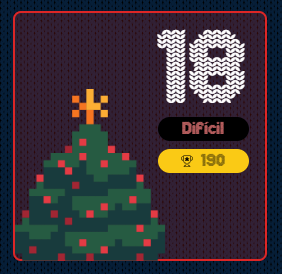

# reto #18 AdventJS



En la fábrica de juguetes, los elfos están programando un reloj digital para mantenerse en horario con la producción de regalos. Sin embargo, se han encontrado con un desafío de programación interesante. Necesitan una función que, dada una hora en formato 'HH:MM', cree una representación visual de esta hora en un reloj digital devolviendo un array de arrays de caracteres.

La pantalla del reloj tiene 7 filas y 17 columnas, y cada dígito de la hora ocupa 7 filas y 3 columnas. Los dígitos están compuestos por asteriscos (*) y espacios en blanco (). Entre cada dígito hay una columna vacía.

Los dos puntos para separar horas y minutos se dibujan usando dos asteríscos (*) y siempre se colocan en la misma posición, en las filas 2 y 4, en la columna 9, respectivamente (nota: la indexación de filas y columnas comienza en 0).

Por ejemplo, si la función recibe 01:30 debe devolver:

```javascript 
drawClock('01:30') // ⬇️

[
  ['*', '*', '*', ' ', ' ', ' ', '*', ' ', ' ', ' ', '*', '*', '*', ' ', '*', '*', '*'],
  ['*', ' ', '*', ' ', ' ', ' ', '*', ' ', ' ', ' ', ' ', ' ', '*', ' ', '*', ' ', '*'],
  ['*', ' ', '*', ' ', ' ', ' ', '*', ' ', '*', ' ', ' ', ' ', '*', ' ', '*', ' ', '*'],
  ['*', ' ', '*', ' ', ' ', ' ', '*', ' ', ' ', ' ', '*', '*', '*', ' ', '*', ' ', '*'],
  ['*', ' ', '*', ' ', ' ', ' ', '*', ' ', '*', ' ', ' ', ' ', '*', ' ', '*', ' ', '*'],
  ['*', ' ', '*', ' ', ' ', ' ', '*', ' ', ' ', ' ', ' ', ' ', '*', ' ', '*', ' ', '*'],
  ['*', '*', '*', ' ', ' ', ' ', '*', ' ', ' ', ' ', '*', '*', '*', ' ', '*', '*', '*']
]
```
Para saber cómo dibujar cada dígito, nos han pasado la siguiente imagen. Como ves, cada dígito está compuesto por 7 filas y 3 columnas. Los píxeles en rojo, nosotros lo representaremos con un asterisco (*), y los píxeles en blanco, con un espacio ()