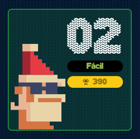

# reto #2 AdventJS



En el taller de Santa, los elfos tienen una lista de regalos que desean fabricar y un conjunto limitado de materiales.

Los regalos son cadenas de texto y los materiales son caracteres. Tu tarea es escribir una función que, dada una lista de regalos y los materiales disponibles, devuelva una lista de los regalos que se pueden fabricar.

Un regalo se puede fabricar si contamos con todos los materiales necesarios para fabricarlo.

```javascript
const gifts = ['tren', 'oso', 'pelota']
const materials = 'tronesa'

manufacture(gifts, materials) // ["tren", "oso"]
// 'tren' SÍ porque sus letras están en 'tronesa'
// 'oso' SÍ porque sus letras están en 'tronesa'
// 'pelota' NO porque sus letras NO están en 'tronesa'

const gifts = ['juego', 'puzzle']
const materials = 'jlepuz'

manufacture(gifts, materials) // ["puzzle"]

const gifts = ['libro', 'ps5']
const materials = 'psli'

manufacture(gifts, materials) // []
```

## Notas de la Solución

```javascript
function manufacture(gifts, materials) {
  /*
    creamos una regex que incluya los materiales de construcción provistos
    usamos template string e indicamos esta regex debe iniciar ^ y terminar $ con estos [materiales]
    notaran que $ esta separado como si fuera otra variable, esto es debido a la web y al servidor de AdventJS.
  */
  let regex = new RegExp(`^[${materials}]+${"$"}`);
  /*
    con la regex procedemos a filtrar cada gift que haga match con los materiales disponibles y sea posible su construcción,
    y aqui viene lo curioso - raro del código, digamos "magia" que le agrada las operaciones del servidor
    esto lo usamos para no tener que declarar una arrow function dentro del filter y "bindear" directamente el contexto a la regex
    con la cual procedemos a testear cada gift de nuestro arreglo gifts, el retornamos.
  */
  return gifts.filter(regex.test.bind(regex));
}

```