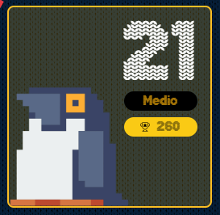

# reto #21 AdventJS



Los elfos están recibiendo mensajes binarios extraños desde Marte 🪐. ¿Los extraterrestres están tratando de comunicarse con ellos? 👽

El mensaje que llega es un array de 0s y 1s. Parece que han encontrado un patrón… Para asegurarse, quieren encontrar el segmento más largo de la cadena donde el número de 0s y 1s sea igual.

```javascript
findBalancedSegment([1, 1, 0, 1, 1, 0, 1, 1])
//                         |________|
// posición del segmento:    [2, 5]
// más largo equilibrado
// de 0s y 1s

findBalancedSegment([1, 1, 0])
//                      |__|
//                     [1, 2]

findBalancedSegment([1, 1, 1])
// no hay segmentos equilibrados: []
```

Ten en cuenta que si hay más de un patrón equilibrado, debes devolver el más largo y el primero que encuentres de izquierda a derecha.

Dicen que si encuentran el patrón, podrán enviar un mensaje de vuelta a Marte 🚀. Parece ser que tienen que enviarlos a https://mars.codes.

