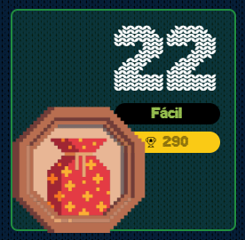

# reto #22 AdventJS



En la fábrica de juguetes de Santa, los elfos están desarrollando un lenguaje de programación llamado Santa.js 👨‍💻👩‍💻 basado en símbolos para controlar sus máquinas de juguetes 🚂.

Han creado un sistema de instrucciones simple y necesitan tu ayuda para construir un compilador que interprete estos símbolos.

El compilador trabaja con un contador que inicialmente tiene un valor de 0. Las instrucciones modificarán el valor de este contador.

Instrucciones del lenguaje de los elfos en base a símbolos:

```
+: Incrementa en 1 el valor del contador.
*: Multiplica por 2 el valor del contador.
-: Resta 1 al valor del contador.
%: Marca un punto de retorno. No modifica el contador.
<: Vuelve atrás una vez a la última instrucción con el símbolo % que haya visto. Si no hay un % previo, no hace nada.
¿: Inicia un bloque condicional que se ejecuta si el contador es mayor a 0.
?: Finaliza un bloque condicional.
```

Crea una función compile que reciba un string con las instrucciones del lenguaje y devuelve el resultado de ejecutarlas. Aquí tienes algunos ejemplos:

```javascript
compile('++*-') // 3
// (1 + 1) * 2 - 1 = 3

compile('++%++<') // 6
// 1 + 1 + 1 + 1 + 1 + 1 = 6

compile('++<--') // 0
// 1 + 1 - 1 - 1 = 0

compile('++¿+?') // 3
// 1 + 1 + 1 = 3

compile('--¿+++?') // -2
// - 1 - 1 = -2
```