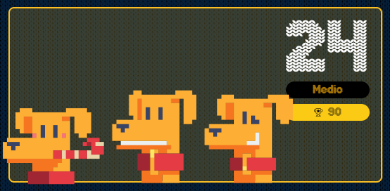

# reto #24 AdventJS



En la aldea de Santa, hay una escalera mágica que lleva a la fábrica de juguetes 🧸. Los elfos, siempre buscando hacer ejercicio y divertirse 🏃‍♂️, deciden saltar los peldaños de la escalera.

Nos dan steps como el número de peldaños de la escalera y el número máximo de peldaños maxJump que un elfo puede saltar en un solo salto.

Tu tarea es ayudar a los elfos a encontrar todas las posibles secuencias de saltos que pueden hacer para subir la escalera, ordenadas de menos a más. Teniendo en cuenta que los elfos pueden saltar como máximo maxJump peldaños en un solo salto (pero pueden saltar menos peldaños si así lo desean).

Por ejemplo, si hay una escalera de steps = 4 y maxJump = 2 es el número máximo de peldaños que un elfo puede saltar en un solo salto, entonces hay cinco secuencias de saltos posibles:

```javascript
[1, 1, 1, 1] (salta 1 peldaño 4 veces)
[1, 1, 2] (salta 1 peldaño 2 veces y luego 2 peldaños)
[1, 2, 1] (salta 1 peldaño, luego 2 peldaños y luego 1 peldaño)
[2, 1, 1] (salta 2 peldaños, luego 1 peldaño y luego 1 peldaño)
[2, 2] (salta 2 peldaños 2 veces)
Más ejemplos:

getStaircasePaths(2, 1) // [[1, 1]]
getStaircasePaths(3, 3) // [[1, 1, 1], [1, 2], [2, 1], [3]]
getStaircasePaths(5, 1) // [[1, 1, 1, 1, 1]]
getStaircasePaths(5, 2)
/*
[
  [1, 1, 1, 1, 1],
  [1, 1, 1, 2],
  [1, 1, 2, 1],
  [1, 2, 1, 1],
  [1, 2, 2],
  [2, 1, 1, 1],
  [2, 1, 2],
  [2, 2, 1],
]
*/
```