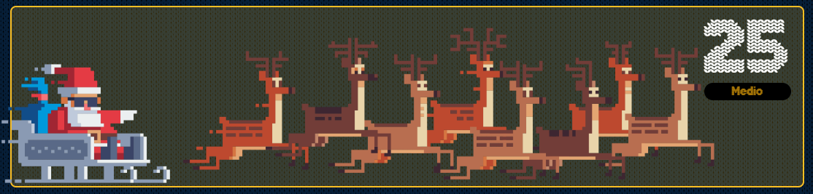

# reto #25 AdventJS



Ya ha entregado Santa Claus 🎅 todos los regalos a los niños pero quieren revisar si pueden mejorar de cara al año que viene.

Los elfos quieren saber cuántos movimientos ha hecho Santa Claus 🛷 para entregar todos los regalos. Para ello, te dan un mapa de la ciudad con la ubicación de cada niño y de Santa.

El mapa es una cadena de texto multi línea donde cada caracter representa una casilla. Los niños se representan por números del 1 al 9 y Santa Claus por la letra S. El resto de casillas son .

Santa Claus sólo puede moverse hacia arriba, abajo, izquierda o derecha, y cada movimiento cuenta como 1 km. Además, siempre empieza en la posición S y debe entregar los regalos en orden, del 1 al 9.

```javascript
const map = `.....1....
..S.......
..........
....3.....
......2...`

const result = travelDistance(map)
console.log(result) // -> 12 km
/*
De la S al niño 1: 4 movimientos
Del niño 1 al 2: 5 movimientos
Del niño 2 al 3: 3 movimientos
Total: 12 movimientos
*/

const result2 = travelDistance(`..S.1...`)
console.log(result2) // -> 2

```
Escribe una función travelDistance que reciba un mapa y devuelva la distancia total que ha recorrido Santa Claus según la posición de los niños.

Ten en cuenta que:

- El mapa no tiene por qué ser cuadrado.
- El mapa siempre tendrá al menos un niño.
- El mapa siempre tendrá una posición inicial para Santa Claus.
- Los números de los niños nunca se repiten.