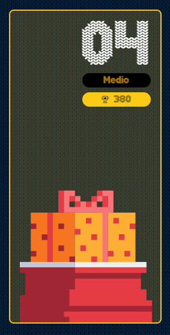

# reto #4 AdventJS



En el taller de Santa 🎅, algunos mensajes navideños han sido escritos de manera peculiar: las letras dentro de los paréntesis deben ser leídas al revés

Santa necesita que estos mensajes estén correctamente formateados. Tu tarea es escribir una función que tome una cadena de texto y revierta los caracteres dentro de cada par de paréntesis, eliminando los paréntesis en el mensaje final.

Eso sí, ten en cuenta que pueden existir paréntesis anidados, por lo que debes invertir los caracteres en el orden correcto.

```javascript
const a = decode('hola (odnum)')
console.log(a) // hola mundo

const b = decode('(olleh) (dlrow)!')
console.log(b) // hello world!

const c = decode('sa(u(cla)atn)s')
console.log(c) // santaclaus

// Paso a paso:
// 1. Invertimos el anidado -> sa(ualcatn)s
// 2. Invertimos el que queda -> santaclaus
```
> Notas:

- Las cadenas de entrada siempre estarán bien formadas con paréntesis que coinciden
- correctamente, no necesitas validarlos.
- En el mensaje final no deben quedar paréntesis.
- El nivel máximo de anidamiento es 2.

## Notas de la Solución

```javascript
function decode(message){
  /*
    Este algoritmo puede resolverse con un bucle, con recursividad, usando regex
    o unicamente métodos de string como es el caso y al parecer uno de los que mas
    puntos permite obtener en el juego.
  */
  do{
    // buscamos el indice del ultimo "(" en abrirse
    let startIndex = message.lastIndexOf("(")
    // buscamos el indice del primer ")" en cerrarse luego de la startIndex
    let endIndex = message.indexOf(")", startIndex)
    // recuperamos la primera parte de nuestro mensaje antes del ultimo "(" abierto
    let start = message.substring(0, startIndex)
    // formateamos el mensaje que encontramos entre el startIndex y el endIndex, es decir que estan entre ()
    // por lo cual debemos primeramente eliminar los "()" para ello usamos slice, y luego invertirlos con reverse
    let middle = [...message.slice(startIndex+1, endIndex)].reverse()
    // recuperamos la parte final de nuestro mensaje luego del primer ")"
    let end = message.slice(endIndex + 1, message.length)
    // reconstruimos el mensaje y procedemos analizar si se encuentra libre de parentesis
    message = start + middle.join('') + end
    // mientras tengamos un parentesis de "(" no tendremos el mensaje decodificado y repetimos nuestro analisis
  }while(message.includes('('))
  // con nuestro mensaje libre de "(" podemos retornar nuestro mensaje formateado o decodificado
  return message
}

```