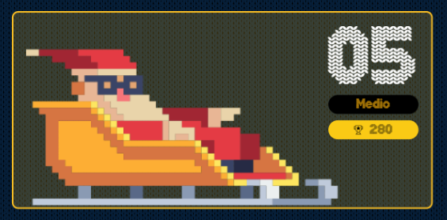

# reto #5 AdventJS



Santa 🎅 está probando su nuevo trineo eléctrico, el CyberReindeer, en una carretera del Polo Norte. La carretera se representa con una cadena de caracteres, donde:

- `.` = Carretera
- `S` = Trineo de Santa
- `*` = Barrera abierta
- `|` = Barrera cerrada

Ejemplo de carretera: S...|....|.....

Cada unidad de tiempo, el trineo avanza una posición a la derecha. Si encuentra una barrera cerrada, se detiene hasta que la barrera se abra. Si está abierta, la atraviesa directamente.

Todas las barreras empiezan cerradas, pero después de 5 unidades de tiempo, se abren todas para siempre.

Crea una función que simule el movimiento del trineo durante un tiempo dado y devuelva un array de cadenas representando el estado de la carretera en cada unidad de tiempo:

```javascript
const road = 'S..|...|..'
const time = 10 // unidades de tiempo
const result = cyberReindeer(road, time)

/* -> result:
[
  'S..|...|..', // estado inicial
  '.S.|...|..', // avanza el trineo la carretera
  '..S|...|..', // avanza el trineo la carretera
  '..S|...|..', // el trineo para en la barrera
  '..S|...|..', // el trineo para en la barrera
  '...S...*..', // se abre la barrera, el trineo avanza
  '...*S..*..', // avanza el trineo la carretera
  '...*.S.*..', // avanza el trineo la carretera
  '...*..S*..', // avanza el trineo la carretera
  '...*...S..', // avanza por la barrera abierta
]
*/

```

El resultado es un array donde cada elemento muestra la carretera en cada unidad de tiempo.

Ten en cuenta que si el trineo está en la misma posición que una barrera, entonces toma su lugar en el array.

## Notas de la Solución

```javascript

function cyberReindeer(road, time) {
  // Iniciamos una variable result a la cual ir agregando nuestros estados en cada tiempo
  // iniciando con el primer estado que es el pasado por argumento "road"
  let result = [road]
  // removemos al trineo de santa "S" de nuestro camino para despejarlo
  road = road.replace("S", ".")
  // creamos un objeto con la unidad de tiempo que abre todas las barreras reemplazando "|" por "*" para siempre
  let roadOpen = {
    5: road.replaceAll("|", "*")
  }
  // creamos otro objeto con las distintas variantes de nuestro camino, las cuales modificaran nuestro movimientos
  let roadDelay = {
    "." : 1,
    '*' : 1,
    "|" : 0
  }
  // iniciamos nuestro camino desde la posición 0 y hasta - mientras mi resultado no tenga todos los tiempos "time"
  // pasados por argumentos a nuestra función 
  let pos = 0
  while(result.length < time){
    // analizamos el tiempo para hacer uso de roadOpen en el time 5 en nuestro caso, asi poder abrir las barreras
    road = roadOpen[result.length] ?? road
    // analizamos nuestro siguiente paso y verificamos si podemos movernos una posición o debemos esperar por una barrera cerrada
    pos += roadDelay[road[pos+1]]
    // añadimos a nuestro resultado el estado actual de nuestro camino, colocando a Santa en nuestro posición actual
    result.push(`${road.substring(0,pos)}S${road.substring(pos+1)}`)
  }
  return result
}

```