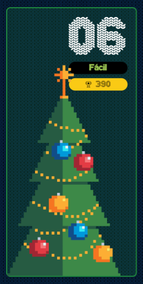

# reto #6 AdventJS



Los elfos están catalogando los renos de Santa 🦌 según la distancia que pueden recorrer.

Para ello tienen una cadena de texto movements donde cada caracter representa la dirección del movimiento del reno:

`>` = Avanza a la derecha
`<` = Avanza a la izquierda
`*` = Puede avanzar o retroceder

Por ejemplo, si el movimiento es `>>*<`, va hacia la derecha dos veces, luego puede ir a derecha o izquierda (lo que maximice la distancia recorrida final) y luego ir a la izquierda.

Los elfos quieren saber cuál es la máxima distancia que recorre el reno al finalizar todos los movimientos.

En el ejemplo anterior, la máxima distancia que recorre el reno es 2. Va a la derecha dos veces +2, luego con el * puede ir a la derecha otra vez para maximizar la distancia +1 y luego va a la izquierda -1.

Crea una función maxDistance que reciba la cadena de texto movements y devuelva la máxima distancia que puede recorrer el reno en cualquier dirección:

```javascript

const movements = '>>*<'
const result = maxDistance(movements)
console.log(result) // -> 2

const movements2 = '<<<>'
const result2 = maxDistance(movements2)
console.log(result2) // -> 2

const movements3 = '>***>'
const result3 = maxDistance(movements3)
console.log(result3) // -> 5
```

Ten en cuenta que no importa si es a la izquierda o la derecha, la distancia es el valor absoluto de la distancia recorrida máxima al finalizar los movimientos.

## Notas de la Solución

```javascript

function maxDistance(movements) {
  // Para este caso hacemos uso de regex y del método match que nos retorna
  // un array con todas las coincidencias encontradas
  // a = pasos a la derecha, si no hay match es 0
  const a = movements.match(/>/g)?.length ?? 0
  // b = pasos a la izquierda, 0 si no hay match
  const b = movements.match(/</g)?.length ?? 0
  // c = total de movimientos existentes menos los encontrados
  // por lo cual son los "*" destinados a maximizar la distancia
  const c = movements.length - a - b;
  // retornamos el valor absoluto de los pasos a la derecha "a" menos los pasos a la izquierda "b"
  // mas el plus "c" que maximiza nuestro distancia
  return Math.abs(a - b) + c
}

```